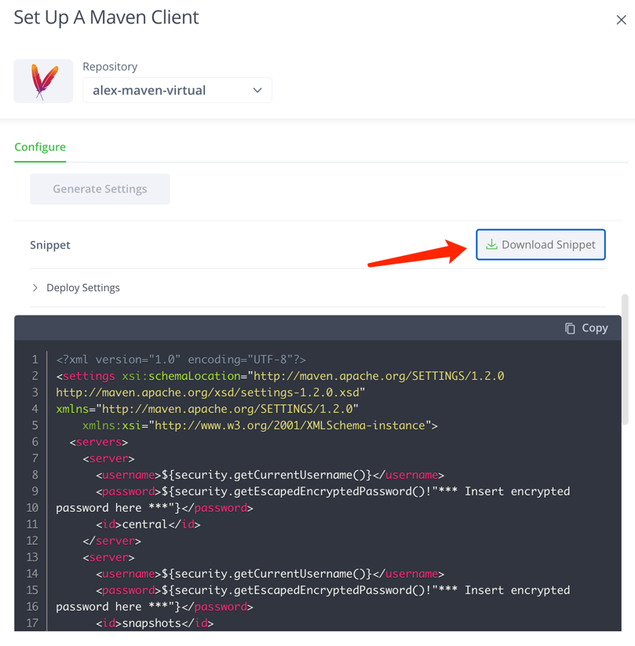

# Clone the code
git clone https://github.com/alexwang66/project-examples.git

# Maven demo
Make sure you are using jdk 1.8
```dtd
/usr/libexec/java_home -V
        1.8.301.09 (x86_64) "Oracle Corporation" - "Java" /Library/Internet Plug-Ins/JavaAppletPlugin.plugin/Contents/Home
        1.8.0_392 (x86_64) "OpenLogic-OpenJDK" - "OpenLogic-OpenJDK 8" /Library/Java/JavaVirtualMachines/openlogic-openjdk-8.jdk/Contents/Home

 export JAVA_HOME=`/usr/libexec/java_home -v 1.8.0_392`
```

## Set up settings.xml

copy the pom.xml int ~/.m2/settings.xml

## Maven package
```dtd
cd project-examples/maven-examples/maven-example
mvn package
```
## Maven deploy
