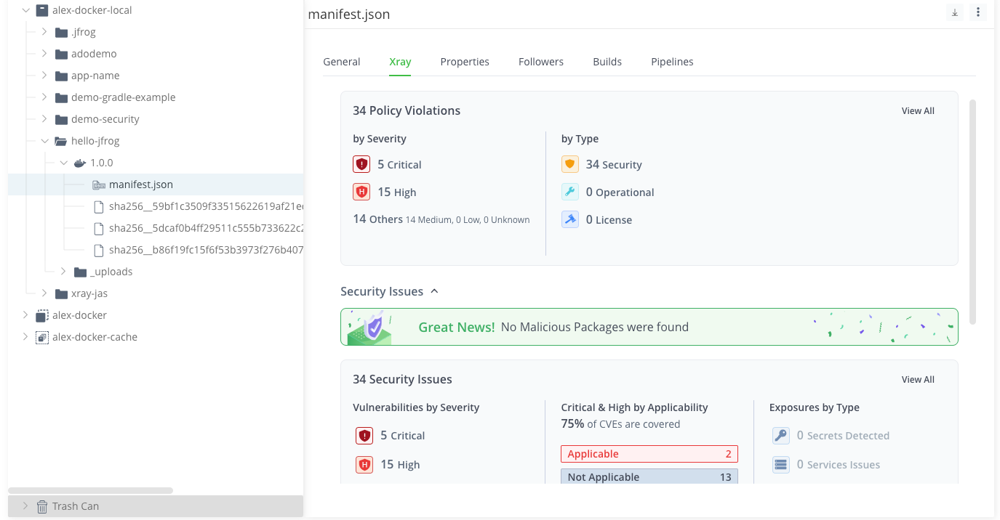
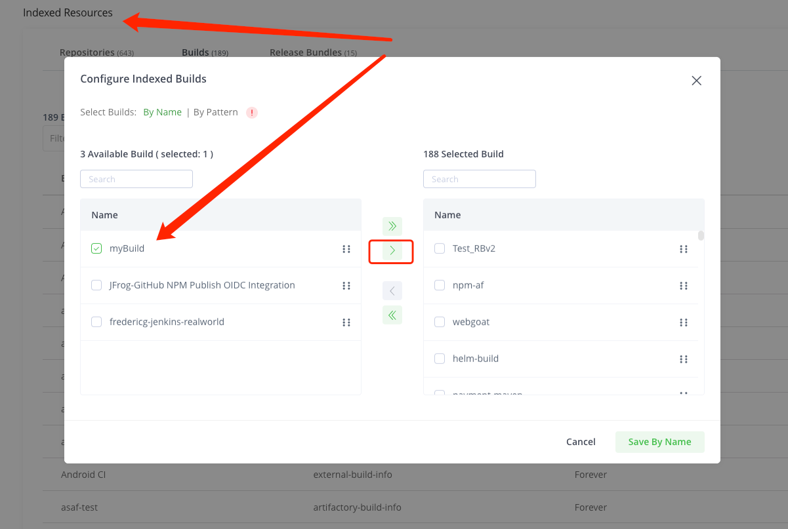
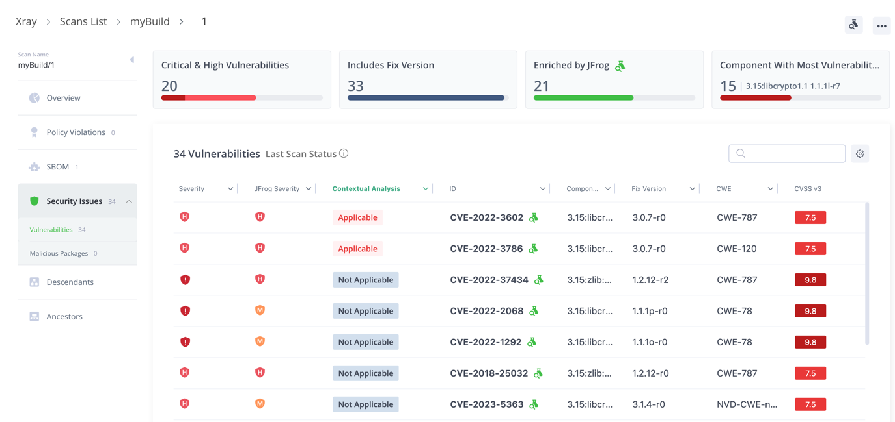

# Docker Example

## General

This is an example showing how to collect build-info, while using Docker to build an image from a Docker file, scan the Docker image and push it to Artifactory.

### Prerequisites for running this example

- Make sure [JFrog CLI](https://jfrog.com/getcli/) 2.13.0 or above is installed and in your system PATH.
- Make sure [Docker](https://docs.docker.com/get-docker/) is installed and in your system PATH.
- Make sure Artifactory can be used as Docker registry. Please refer to [Getting Started with Artifactory as a Docker Registry](https://www.jfrog.com/confluence/display/JFROG/Getting+Started+with+Artifactory+as+a+Docker+Registry) in the JFrog Artifactory User Guide. You should end up with a Docker registry URL, which is mapped to a local Docker repository (or a virtual Docker repository with a local deployment target) in Artifactory. You'll need to know the name of the Docker repository, to later collect the published image build-info.

### Validating your setup

- In your terminal, validate that the following commands work.

```console
# Output Docker version
docker --version

# Output JFrog CLI version 2.13.0 or above.
jf --version
```

## Running the Example

- Clone this repository.
- 'cd' into this example directory.
- Run the following commands, after replacing **DOCKER_REG_URL** with your Artifactory Docker registry URL and **TARGET_REPO** with the target repository name in Artifactory. **TARGET_REPO** is the name of the Artifactory repository mentioned in the [Prerequisites for running this example](#prerequisites-for-running-this-example) section.

```sh
# Configure your JFrog Platform connection details
jf c add artifactory --basic-auth-only --url "http://myArtifactoryURL:8082" --user alex --password "AKCp8m........." --interactive=false
# config jf to use the config name
jf c use artifactory
# Configure Docker image name
# Example: export DOCKER_IMAGE_NAME=acme.jfrog.io/alexwang-docker/hello-jfrog:1.0.0
export DOCKER_IMAGE_NAME=$DOCKER_REG_URL/$TARGET_REPO/hello-frog:1.0.0

# Build Docker image
docker build -t $DOCKER_IMAGE_NAME .

# Scan Docker image for vulnerabilities

jf docker scan $DOCKER_IMAGE_NAME
```

# Push image to Artifactory
```
jf docker push $DOCKER_IMAGE_NAME
```


```
# Configure build name and build number
export JFROG_CLI_BUILD_NAME=myBuild
export JFROG_CLI_BUILD_NUMBER=1

# Publish build info
jf rt build-publish
```

# Index build in Xray


# Scan build 
jf bs myBuild 1  
View result in xray scan list page

