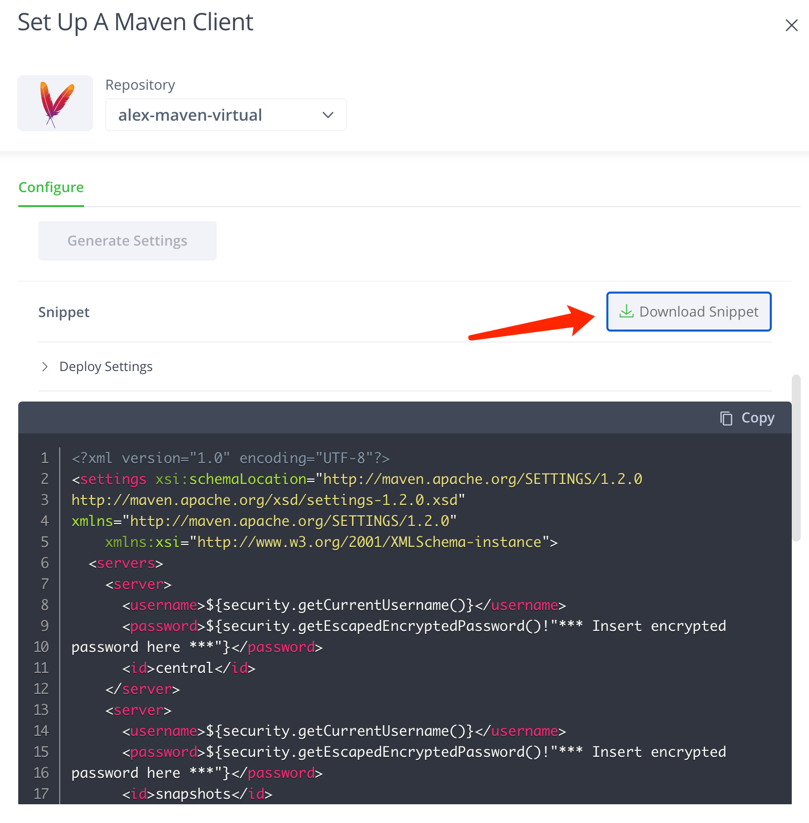
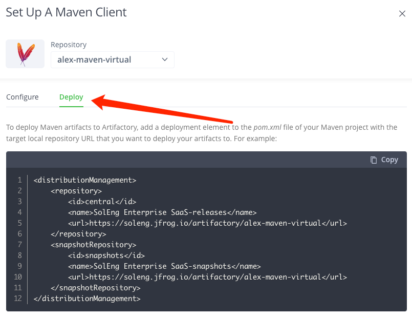
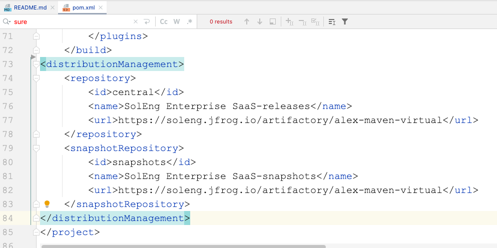
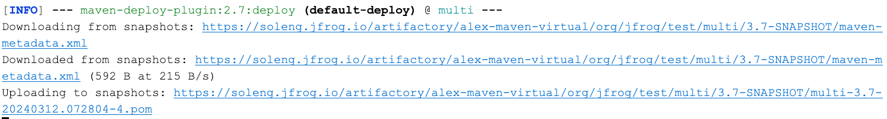
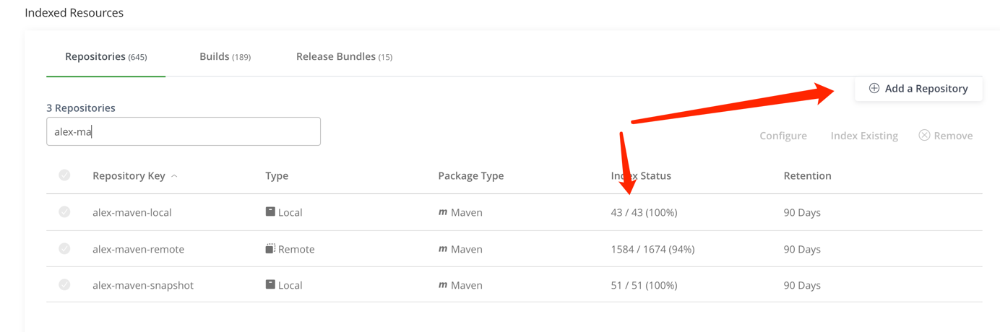
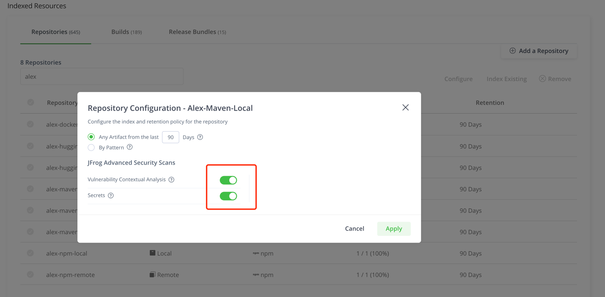
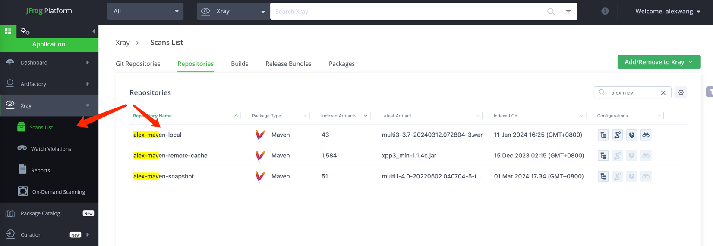
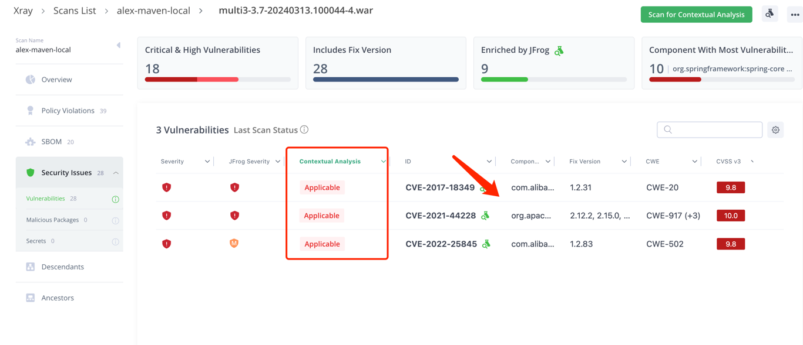
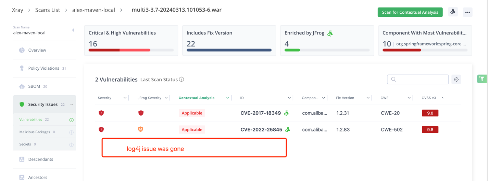

# Clone the code
git clone https://github.com/alexwang66/project-examples.git

# Maven demo
Make sure you are using jdk 1.8
```dtd
/usr/libexec/java_home -V
        1.8.301.09 (x86_64) "Oracle Corporation" - "Java" /Library/Internet Plug-Ins/JavaAppletPlugin.plugin/Contents/Home
        1.8.0_392 (x86_64) "OpenLogic-OpenJDK" - "OpenLogic-OpenJDK 8" /Library/Java/JavaVirtualMachines/openlogic-openjdk-8.jdk/Contents/Home

 export JAVA_HOME=`/usr/libexec/java_home -v 1.8.0_392`
```

## Set up settings.xml

copy the settings.xml file into ~/.m2/settings.xml

## Maven package
```dtd
cd project-examples/maven-examples/maven-example
mvn package
```
## Maven deploy


Go to Deploy tab and copy the code snippet, paste into the bottom part of the file
```
/project-examples/maven-examples/maven-example/pom.xml
```


Run maven deploy
```dtd
mvn deploy
```

You can see the package is download and upload into Artifactory server.

# Index repository in Xray 


# Enable JAS scanning


# Check scan result in scan list


# Adding vulnerable dependency log4j in pom file: project-examples/maven-examples/maven-example/pom.xml
```dtd
        <dependency>
            <groupId>org.apache.logging.log4j</groupId>
            <artifactId>log4j-core</artifactId>
            <version>2.9.1</version>
        </dependency>
```

# Repackage and scan, view the JAS results:


# Upgrade the dependency version to do the security fix.
```dtd
		<dependency>
			<groupId>org.apache.logging.log4j</groupId>
			<artifactId>log4j-core</artifactId>
			<version>2.20.0</version>
		</dependency>
```

# Verify the log4j issue was fix
