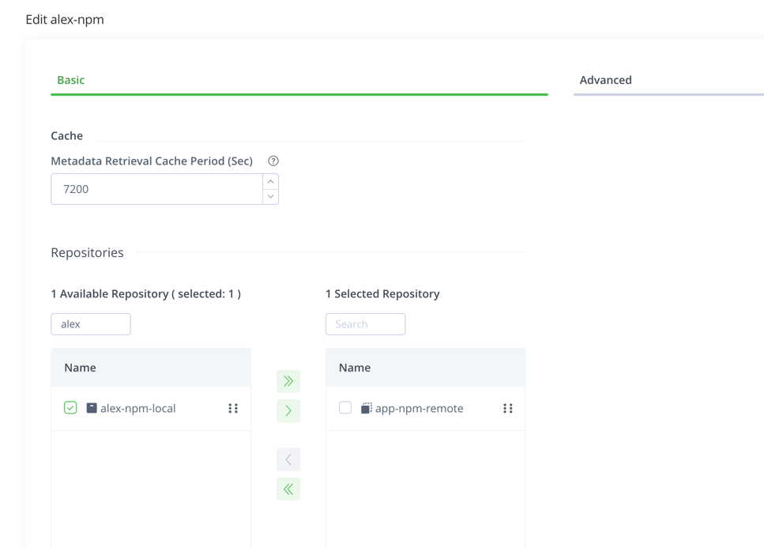
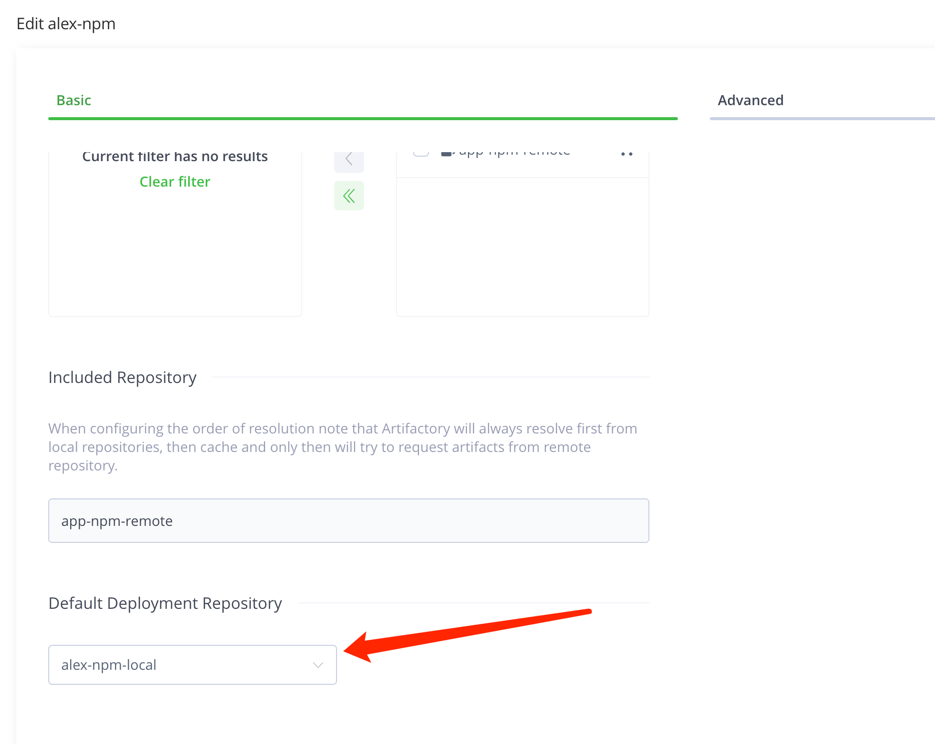

# NPM Example

## Overview

Artifactory provides full support for managing npm packages and ensures optimal and reliable access to npmjs.org. It also allows aggregating multiple npm registries under a virtual repository Artifactory, which provides access to all your npm packages through a single URL for both upload and download.

You may store exhaustive build information in Artifactory by running your npm builds with [JFrog CLI](https://www.jfrog.com/confluence/display/CLI/JFrog+CLI).
JFrog CLI collects build-info from your build agents and then publishes it to Artifactory. Once published, the build info can be viewed in the Build Browser under Builds.
For more details on npm build integration using JFrog CLI, please refer to [Building npm Packages](https://www.jfrog.com/confluence/display/CLI/CLI+for+JFrog+Artifactory#CLIforJFrogArtifactory-BuildingNpmPackagesUsingtheNpmClient) in the JFrog CLI User Guide.

## This Example

This example demonstrates how to build a npm project using JFrog CLI. The build does the following:

1. Downloads its npm dependencies from Artifactory.
2. Packs and uploads the built package to Artifactory.
3. Records and publishes build-info to Artifactory.

# Prerequisite

1. Make sure your local machine has _npm_ version 5.4.0 or above installed and that _npm_ is included in the PATH. To verify this, run `npm -v`.
2. Make sure your local machine has the latest version of [JFrog CLI](https://jfrog.com/getcli/).
3. Make sure you're using a non-OSS JFrog Artifactory with version 5.5.2 or above.

# Creating Repositories

Create the following repositories on your Artifactory instance:

1. A remote npm repository. Make sure the repository has *https://registry.npmjs.org* configured as its URL (this is the default when creating the repository).
2. A local npm repository.

3. A virtual repository:
   - Include the remote and local repositories as part of the new virtual repository.
   - Set the new local repository as the **Default Deployment Repository** of the new virtual repository.


4. The repository structure:

# Running the Example

'cd' to the root project directory.

Configure Artifactory:

Configure your JFrog Platform connection details
```dtd
jf c add artifactory --basic-auth-only --url "http://myArtifactoryURL:8082" --user alex --password "AKCp8m........." --interactive=false

```
config jf to use the config name
```dtd
jf c use artifact
```
Configure the npm project and select the virtual repository as the resolution and deployment repository:

```
jf npm-config --repo-resolve=<NPM_RESOLVE_REPO> --repo-deploy=<NPM_DEPLOY_REPO>
```

Build the project and record the dependencies as part of the build-info:

```
jf npm install --build-name my-npm-build --build-number 1
```

Add environment variables to the build-info.

```
jf rt bce my-npm-build 1
```

Add git information to the build-info.

```
jf rt bag my-npm-build 1
```

Pack and publish the npm package to Artifactory, while recording it as an artifact in the build-info:

```
jf npm publish --build-name my-npm-build --build-number 1
```

Publish the build info to Artifactory:

```
jf rt bp my-npm-build 1
```
